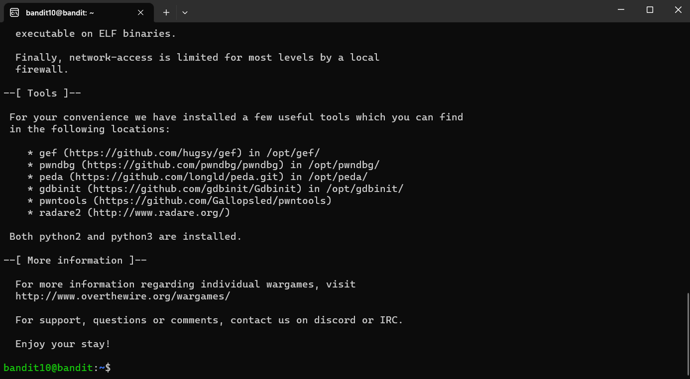

#### Bash commands

```bash
# 0
$ ssh bandit0@bandit.labs.overthewire.org -p 2220 #login on the server using ssh

# 1
$ ls  #list directory contents
$ cat # output the text of readme file

#2
$ ls -la #to see the list of hidden files
$ cat ./- #output the text of readme file

#3
$ cat "spaces\ in\ this\ filename"

#4
$ ls -la
$ cat .hidden

#5
$ cat -- -file* #The double dash -- is used to tell the command that the subsequent arguments are file names, not options.

#6
$ find inhere -type f -readable -size 1033c ! -executable # This command will search for all files in the "inhere" directory that are human-readable, not executable, and have a size of exactly 1033 bytes.

#7
$ find / -user bandit7 -group bandit6 -type f -size 33c # This command will search for all files on the server that are owned by user bandit7, owned by group bandit6

#8
$ grep millionth data.txt | cut -d ' ' -f 2 # This command will search for the word "millionth" in the file "data.txt" and extract the second field using the cut command.
    # -cut command extracts the second field
    # -d option specifies the delimiter used in the file
    # -f option specifies which field to extract

#9
$ sort data.txt | uniq -u # uniq output

```

###### Bandit10 screenshot


